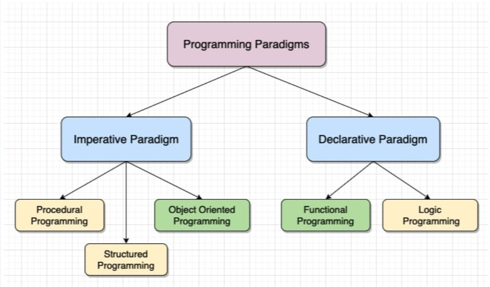

# Texto Sobre Paradigmas
## Paradigma Imperativo

**Baseia-se em um conjunto de instruções em que cada passo define o que deve ser feito e como o programa deve executar, seguindo uma sequência lógica passo a passo.**

### Programação Estruturada:
    Essa abordagem visa melhorar a legibilidade e organização do código. Suas principais características incluem o uso de blocos de controle de fluxo, como estruturas de decisão (if, else), estruturas de repetição (for, while) e divisão do código em funções.
**Exemplos de linguagens:**
- Cobol
- PHP
- Perl
- Go

### Programação Procedural:
    É uma evolução da programação estruturada, onde o foco está na organização do código em procedimentos (funções). O programa é dividido em partes menores, facilitando reutilização e manutenção.
**Exemplos de linguagens:**
- C
- C ++ 
- Java
- Pascal

### Programação Orientada a Objetos (POO):
    A POO organiza o código em objetos, que representam entidades do mundo real. Ou seja, é uma forma de programar que simplifica programas complexos dividindo-os em unidades menores, que são os objetos. Essa organização é dividia em classes, atributos e métodos. 
**Pilares:**
- **Herança**: Criação de novas classes com base em classes existentes.

- **Polimorfismo**: Trata-se da capacidade de um objeto se passar por outro compatível.

- **Encapsulamento**: Gerenciamento do acesso a atributos e métodos.

- **Abstração**: Representação de conceitos essenciais do mundo real.
#

## Paradigma Declarativo
**Diferente do paradigma imperativo, o paradigma declarativo foca em o que deve ser feito, e não como fazer. Aqui o fluxo de controle não é o elemento mais importante do programa, mas sim alcançar o objetivo definido.**

### Programação Funcional:
    Baseia-se no uso de funções matemáticas puras, evitando mudanças de estado e efeitos colaterais. Não existe uma lista de instruções ou objetos.
- Haskell
- Scala
- JS
- Clojure
### Programação Lógica: 
    Segue regras e fatos para chegar a uma conclusão. O programador define relações e o sistema encontra a solução.
- Prolog
- Datalog

## Fluxo:


#
## Comparação entre Java (Imperativo) e Prolog (Declarativo)

### Código completo em Java

```java
package fag;

import java.util.Scanner;

public class Calculadora {
    static Scanner scan = new Scanner(System.in); 
    
    public static void main(String args[]) {
        Menu();
    }
    
    public static void Menu() {
        System.out.println("-----------------------------------");
        System.out.println("Escolha a Operação");
        System.out.println("[1] - Calcular Preço Total");
        System.out.println("[2] - Calcular Troco");
        System.out.println("[3] - Sair");
        int escolha = scan.nextInt();
        
        switch (escolha) {
            case 1:
                PrecoTotal();
            break;
            
            case 2:
                Troco();
            break;

            case 3:
                System.out.println("Você saiu do sistema...");
                return;

            default:
                System.out.println("Input invalido");
            break;
        }
        Menu();
    }
    
    public static void PrecoTotal() {
        System.out.println("Qual a quantidade do item ?");
        double qtd = scan.nextDouble();
        if (qtd <= 0) {
            System.out.println("quantidade invalida");
            return;
        }
        System.out.println("Qual o valor unitario? ");
        double vlrunt = scan.nextDouble();
        if (vlrunt <= 0) {
            System.out.println("valor invalido");
            return;
        }
        
        double total = qtd * vlrunt;
        System.out.println("o Total é " + total);
    }
    
    public static void Troco() {
        System.out.println("Qual o valor pago pelo cliente ?");
        double vlrPago = scan.nextDouble();
        if (vlrPago <= 0) {
            System.out.println("valor invalido");
            return;
        }
        System.out.println("Qual o total da compra ?");
        double vlrTotal = scan.nextDouble();
        if (vlrTotal <= 0) {
            System.out.println("valor invalido");
            return;
        }
        
        double troco = vlrPago - vlrTotal;
        if (troco < 0) {
            System.out.println("Faltam " + troco * -1 + " para completar");
        } else {
            System.out.println("o Troco é de R$" + troco);
        }
    }
}
```

---

### Código completo em Prolog

```prolog
% Fatos e regras principais

% preço total
preco_total(Qtd, ValorUnitario, Total) :-
    Qtd > 0,
    ValorUnitario > 0,
    Total is Qtd * ValorUnitario.

% troco
calcular_troco(ValorPago, ValorTotal, Troco) :-
    ValorPago >= ValorTotal,
    Troco is ValorPago - ValorTotal.

% falta de pagamento
falta_pagamento(ValorPago, ValorTotal, Falta) :-
    ValorPago < ValorTotal,
    Falta is ValorTotal - ValorPago.

% exemplos de consultas:
% ?- preco_total(10, 5, Total).
% ?- calcular_troco(50, 30, Troco).
% ?- falta_pagamento(20, 30, Falta).
```


## Comparação

### Java (Imperativo):

- Controle total do fluxo (menu, decisões, repetição).
- Entrada e saída de dados explícitas.
- Uso de validações (if).
- Código mais detalhado.
- Define como resolver o problema.

### Prolog (Declarativo):

- Baseado em regras e relações.
- Não há fluxo explícito.
- Execução feita por consultas.
- Código mais simples e direto.
- Define o que resolver.

### Conclusão
    O paradigma imperativo, representado pelo Java, exige que o programador controle toda a execução do sistema, definindo cada passo necessário para alcançar o resultado. Já o paradigma declarativo, representado pelo Prolog, permite uma abordagem mais abstrata, onde o foco está na definição das regras do problema. Dessa forma, enquanto o Java oferece maior controle e detalhamento, o Prolog proporciona uma solução mais simples e focada na lógica, evidenciando duas formas distintas de resolver o mesmo problema.
